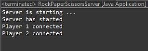
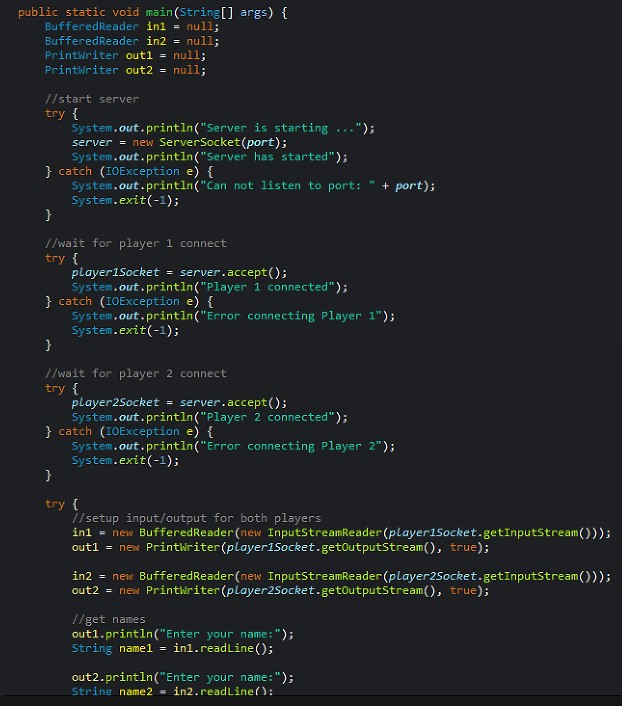

# RPS Network Application

This repository contains a console-based, multi-player RPS application implemented in Java. The project was developed as part of a Data Communication and Networks course to demonstrate applied TCP socket programming and client-server architecture.

The system consists of a central server that coordinates client connections and execution logic for two separate client instances representing the players.

---

## Architecture Overview

The application utilizes a blocking, synchronous model over TCP to manage the flow:

1. **Server Initialization**: The server starts and listens on port `36200` for incoming TCP connections.
2. **Player Connection**: The server blocks until two clients connect sequentially (Player 1 followed by Player 2).
3. **Data Exchange**:
   * The server prompts Player 1 and Player 2 for their names.
   * The server prompts each player to input their move (`1` for Rock, `2` for Paper, `3` for Scissors).
4. **Logic Evaluation**: The server processes the inputs, decides the outcome (win, lose, or draw), and sends the corresponding results back to each client.
5. **Connection Termination**: Sockets and stream connections are closed, and the server shuts down.

---

## Core Technologies

* **Language**: Java
* **Networking APIs**: `java.net.ServerSocket`, `java.net.Socket`
* **Input/Output Streams**: `java.io.BufferedReader`, `java.io.PrintWriter`

---

## File Structure

* `RPSServer.java`: Handles socket listening, client management, input parsing, state evaluation, and result reporting.
* `RPSClient.java`: Connects to the server, handles console inputs from the user, transmits inputs, and displays the server's responses.

---

## Compilation and Running the Application

Because runtime and compilation environments can differ (for example, compiling with a newer JDK like version 24 but running on an older runtime like Java 8), you can specify the release version during compilation to ensure compatibility.

### Step 1: Compile the Source Code

Compile both files using the command line:

```bash
# Compile the Server
javac --release 8 RockPaperScissorsServer.java

# Compile the Client
javac --release 8 RockPaperScissorsClient.java
```

### Step 2: Run the Server

Start the server to listen for incoming connections:

```bash
java RPSServer
```

*Expected Server Output:*
```text
Server is starting ...
Server has started
```

### Step 3: Run the Clients

Open two separate terminal windows and launch the clients:

```bash
java RPSClient
```

---

## Execution Example

### Player 1 (Shaheer) Terminal
```text
Connected to game server
Enter your name:
Shaheer
Choose your move (1=Rock, 2=Paper, 3=Scissors):
1
Hi Shaheer, You win!
```

### Player 2 (Shamsi) Terminal
```text
Connected to game server
Enter your name:
Shamsi
Choose your move (1=Rock, 2=Paper, 3=Scissors):
3
Hi Shamsi, You lose!
```

### Server Logs
```text
Server is starting ...
Server has started
Player 1 connected
Player 2 connected
```


## Images

### Output and Behaviour
TUI output representing server behaviour:



### Server Sourcecode
The running server instance sourcecode alongside the active client connection terminals:



